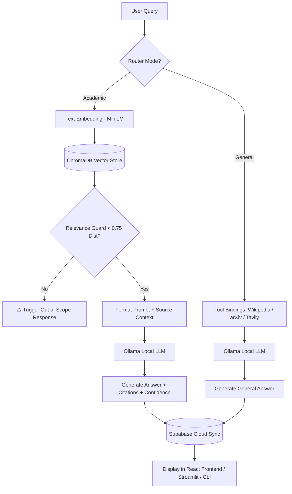

# 🛡️ AEGIS — Academic Evidence-Guided Information System

[](https://www.python.org/)
[](https://fastapi.tiangolo.com/)
[](https://react.dev/)
[](https://tailwindcss.com/)
[](https://ollama.com/)
[](https://supabase.com/)
[](https://www.trychroma.com/)

AEGIS is a state-of-the-art, local-first **Retrieval-Augmented Generation (RAG)** assistant specifically built for students and faculty of **Sree Saraswathi Thyagaraja College (STC), Pollachi**. It retrieves authoritative data from the STC College Handbook (2025-26) to provide precise, cited academic and operational information.

---

## 🌟 Key Features

*   **Local-First Retrieval Architecture**: Keeps data retrieval completely private and localized using a **ChromaDB** vector store and the `all-MiniLM-L6-v2` embedding model.
*   **Pluggable Local LLMs**: Integrates with local LLM runtimes managed via **Ollama** (defaulting to the highly optimized `gemma4:e4b`).
*   **Dual-Core Query Routing**:
    *   **Academic Mode**: Strict handbook-only retrieval with out-of-scope guards and source page/topic citations.
    *   **General Mode**: Connects with tool bindings like Wikipedia, arXiv, and Tavily Web Search.
*   **Multi-Session Cloud Chat Sync**: Persists and structures user chat history across devices via **Supabase**.
*   **"The Kinetic Ether" Interface**: A beautiful glassmorphism-based dark theme featuring translucent glowing surfaces, text gradients, responsive mobile layouts, and a sidebar for session tracking.
*   **Versatile Interfaces**:
    *   **React + Vite + TypeScript Web Frontend** (Modern flagship app)
    *   **Streamlit UI** (Fast Python-native workspace dashboard)
    *   **Interactive CLI** (Terminal-based environment)

---

## 🏗️ System Architecture



---

## 📋 Prerequisites

Ensure you have the following installed based on your operating system:
*   **Python 3.10+** (Tested up to Python 3.14)
*   **Node.js 18+**
*   **Ollama**
*   **Supabase Account** (For cloud session persistence)

---

## ⚙️ Setup & Installation

Follow the appropriate instructions below to set up AEGIS on your operating system.

### 🐧 Linux Setup

1.  **Clone & Navigate to Project Root**:
    ```bash
    git clone https://github.com/Deepak-desk/aegis.git
    cd aegis
    ```

2.  **Set Up Python Virtual Environment**:
    ```bash
    python3 -m venv venv
    source venv/bin/activate
    pip install -r requirements.txt
    ```

3.  **Set Up Frontend Dependencies** (using `nvm` to manage Node):
    ```bash
    curl -o- https://raw.githubusercontent.com/nvm-sh/nvm/v0.39.7/install.sh | bash
    source ~/.bashrc
    nvm install 20
    nvm use 20
    
    cd frontend
    npm install
    cd ..
    ```

4.  **Install & Run Ollama**:
    ```bash
    curl -fsSL https://ollama.com/install.sh | sh
    ollama serve
    ```
    *In a separate terminal, pull the default model:*
    ```bash
    ollama pull gemma4:e4b
    ```

---

###  macOS Setup

1.  **Clone & Navigate to Project Root**:
    ```bash
    git clone https://github.com/Deepak-desk/aegis.git
    cd aegis
    ```

2.  **Set Up Python Virtual Environment**:
    ```bash
    # Install Python via Homebrew if you don't have it: brew install python
    python3 -m venv venv
    source venv/bin/activate
    pip install -r requirements.txt
    ```

3.  **Set Up Frontend Dependencies**:
    ```bash
    # Install Node.js via Homebrew or nvm: brew install node
    cd frontend
    npm install
    cd ..
    ```

4.  **Install & Run Ollama**:
    *   Download and install the macOS application directly from [Ollama.com](https://ollama.com/).
    *   Launch the Ollama application, then pull the model in your terminal:
    ```bash
    ollama pull gemma4:e4b
    ```

---

### 🪟 Windows Setup

We recommend using **PowerShell (Admin)** or **Git Bash**.

1.  **Clone & Navigate to Project Root**:
    ```powershell
    git clone https://github.com/Deepak-desk/aegis.git
    cd aegis
    ```

2.  **Set Up Python Virtual Environment**:
    ```powershell
    python -m venv venv
    .\venv\Scripts\Activate.ps1
    pip install -r requirements.txt
    ```
    *Note: If you receive a script execution policy error, run `Set-ExecutionPolicy -ExecutionPolicy RemoteSigned -Scope Process` in PowerShell first.*

3.  **Set Up Frontend Dependencies**:
    *   Install Node.js using [nvm-windows](https://github.com/coreybutler/nvm-windows) or download the LTS installer from [nodejs.org](https://nodejs.org/).
    *   Verify Node installation: `node -v`
    *   Install packages:
    ```powershell
    cd frontend
    npm install
    cd ..
    ```

4.  **Install & Run Ollama**:
    *   Download the Windows Installer from [Ollama.com](https://ollama.com/).
    *   Once installed, run the app, open PowerShell, and pull the model:
    ```powershell
    ollama pull gemma4:e4b
    ```

---

## 🗄️ Supabase Configuration & Migrations

AEGIS saves chat sessions and messages securely to your Supabase PostgreSQL cluster.

### 1. Configure Credentials
Create a `.env` file in the project root:
```env
SUPABASE_URL="https://your-project-id.supabase.co"
SUPABASE_KEY="your-anon-role-key"
```

### 2. Run Database Migrations
1.  Navigate to your [Supabase Dashboard](https://supabase.com/dashboard) and select your project.
2.  Click **SQL Editor** on the left panel, and open a new query sheet.
3.  Copy and run the contents of [database_migration.sql](file:///home/deepak-desk/Documents/Deepak's%20laptop%20backup/AEGIS/database_migration.sql).
4.  Confirm that the tables `chat_history` and `chat_sessions` exist and have correct schemas.

For a detailed migration overview, see [RUN_THIS_MIGRATION_FIRST.md](file:///home/deepak-desk/Documents/Deepak's%20laptop%20backup/AEGIS/RUN_THIS_MIGRATION_FIRST.md).

---

## 🚀 Running the System

Ensure your virtual environment is active (`source venv/bin/activate` or `.\venv\Scripts\Activate.ps1`) and your Ollama server is running.

### 1. Ingestion (Initialize Knowledge Base)
To index the college handbook documents into the ChromaDB vector store:
```bash
python ingest.py
```

### 2. Run the FastAPI Backend
Start the backend server on `http://localhost:8000`:
```bash
uvicorn server:app --host 0.0.0.0 --port 8000
```

### 3. Run the React Frontend
Launch the modern Vite web UI on `http://localhost:5173`:
```bash
cd frontend
npm run dev
```

### 4. Alternative Streamlit Interface
If you want to view or run the Streamlit dashboard app:
```bash
streamlit run ui/streamlit_ui.py
```

### 5. Alternative CLI Mode
Run RAG queries directly from your terminal:
```bash
# Start Interactive Terminal Chat
python query.py

# Run Automated Demo Suite
python query.py --demo
```

---

## 📁 Developer File Map

*   [`server.py`](file:///home/deepak-desk/Documents/Deepak's%20laptop%20backup/AEGIS/server.py): FastAPI web server and REST API endpoints.
*   [`query.py`](file:///home/deepak-desk/Documents/Deepak's%20laptop%20backup/AEGIS/query.py): Core RAG execution, Out-Of-Scope verification, and CLI routines.
*   [`database.py`](file:///home/deepak-desk/Documents/Deepak's%20laptop%20backup/AEGIS/database.py): Interface methods for Supabase queries.
*   [`ingest.py`](file:///home/deepak-desk/Documents/Deepak's%20laptop%20backup/AEGIS/ingest.py): Handbook extraction, chunking, and embedding creation.
*   [`frontend/src/`](file:///home/deepak-desk/Documents/Deepak's%20laptop%20backup/AEGIS/frontend/src): Core React chat interface components and styling.
*   [`new-ui/DESIGN.md`](file:///home/deepak-desk/Documents/Deepak's%20laptop%20backup/AEGIS/new-ui/DESIGN.md): "The Kinetic Ether" design specs.

---

🛡️ Developed with care for Sree Saraswathi Thyagaraja College (STC).
